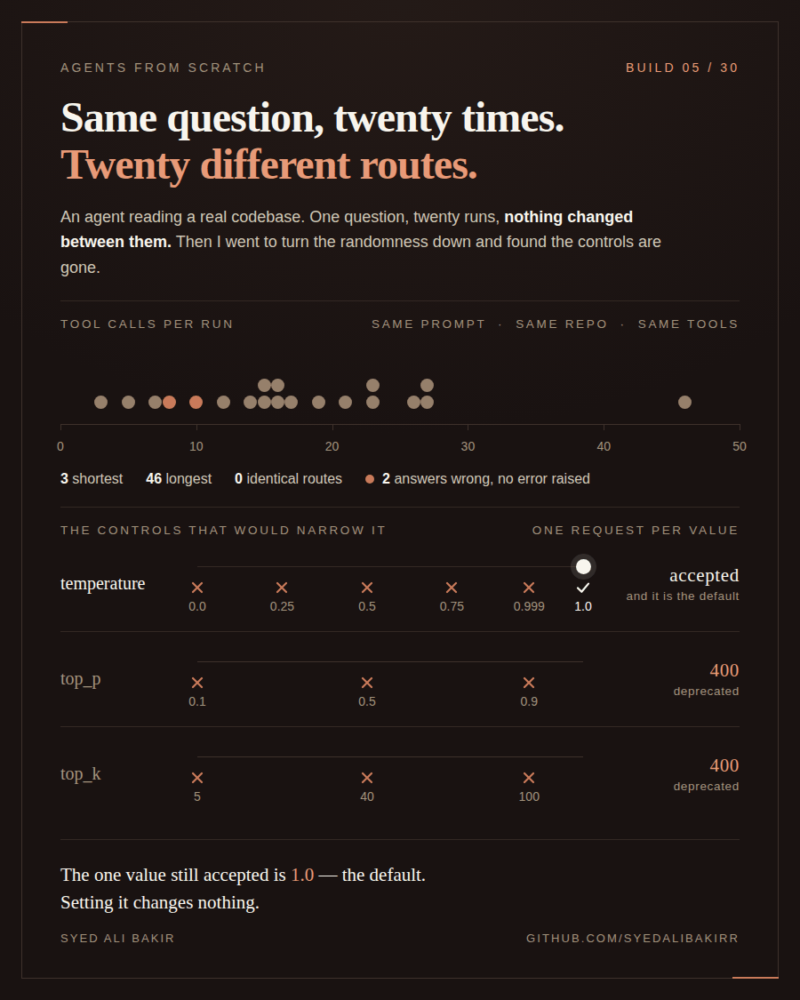

# Build 05 — 20 runs, one question, default temperature

<p align="center">
  
</p>

Animated version: [`assets/build5_p45.gif`](./assets/build5_p45.gif)

This build asks the same question 20 times against a fixed external repo, with no
`temperature` parameter passed to the API, and looks at how much the tool-call count
and the final answer vary run to run. A second, planned batch at an explicit
`temperature=0` never produced results — every one of those 20 calls was rejected by
the model before a single tool call happened. That failure, and the fact that the
test runner's own logging made it look like 20 clean, silent runs, is as much a
finding here as the temperature-1 data.

## Setup

- Agent: the same loop as build-01/build-03/build-04 (`agent.py`), with one addition —
  a `TEMP` env var is read (`float(os.environ.get("TEMP", "1.0"))`) and passed as
  `temperature=TEMP` into `client.messages.create()`. If `TEMP` is unset, this
  evaluates to `1.0`, which is also the API's own default when no `temperature` is
  sent — so an unset `TEMP` and an explicitly-passed `temperature=1.0` are not quite
  the same request, a distinction that matters for what happened here (see
  **The mistake**, below).
- Model: `claude-sonnet-5`.
- Condition: `clean` throughout (`FLOOD` unset — exactly 3 tools: `list_files`,
  `read_file`, `search`).
- Question (Q1 from `run_test.py`'s question list): *"Which of these three folders
  is the live backend: server, python-backend, or triptic-backend?"*
- Target repo: a fixed external codebase (`~/Desktop/Cursor - LP`, not part of this
  repo).
- 20 runs at API-default temperature (`TEMP` unset). A second batch of 20 runs was
  attempted at `TEMP=0` and is not part of the results below — see **The mistake**.

### Ground truth

The question has a factual answer: exactly one of `server`, `python-backend`, or
`triptic-backend` is the backend the live frontend actually talks to. As recorded by
the person running this build, the ground truth is **`python-backend`**, established
by hand: the frontend's client code points its API base URL at port 8000; the service
that actually binds port 8000 is `python-backend`; and `server` (the other backend
candidate) has its routes commented out / not wired into the live path. I did not
have access to the target repo myself while writing this README, so I have not
independently re-verified this chain — it is stated as recorded, not confirmed by me.

## Results: 20 runs, API default temperature

Full per-run detail is in
[`RESULTS_20_RUNS_DEFAULT.md`](./RESULTS_20_RUNS_DEFAULT.md).

**Tool-call counts**, in run order:

```
23, 7, 8, 16, 16, 17, 46, 14, 23, 10, 15, 27, 26, 12, 15, 3, 5, 21, 19, 27
```

- n = 20, min = 3, max = 46, mean = 17.55, median = 16.5
- Four pairs of runs happened to land on the same tool-call count — 16 (twice), 23
  (twice), 15 (twice), 27 (twice) — but in every one of those four pairs the actual
  sequence of tools called differs between the two runs. Same count, different path;
  no two runs in this batch called an identical sequence of tools.

**Answer split:**

| Answer | Runs | Fraction |
|---|---|---|
| python-backend | 18 | 90% |
| server | 2 | 10% |

18 of 20 runs matched the recorded ground truth (`python-backend`); 2 did not.

## The two wrong runs

Both wrong runs answered **`server`** instead of `python-backend`, and both are on
the shorter end of the tool-call distribution, not the longest:

- Run with **8 tool calls**: read `CLAUDE.md`, `triptic-backend/main.py`, and
  `python-backend/README.md`, but never opened `server/`'s own source (e.g.
  `server/src/server.tsx`). It concluded `server` was live because a diagram in
  `python-backend/README.md` labeled `server/` as "(Node.js backend - Express)"
  without reading further to check whether that backend was still wired up to
  anything.
- Run with **10 tool calls**: did read `server/src/server.tsx` directly and treated
  its presence — a working Express app with routes and `app.listen()` — as evidence
  it was the live backend, without cross-checking whether the frontend actually calls
  it.

No error was raised in either case. Both runs completed normally, used a real chain
of tool calls, and produced a confident, well-cited final answer that was simply
wrong. Nothing in the trace or the transcript distinguishes these two runs from the
18 correct ones except the conclusion drawn from the evidence.

## Confidence interval on the error rate

2 wrong answers out of 20 runs = a 10.0% observed error rate. The 95%
Clopper-Pearson interval, computed directly with `math.comb` (no `scipy`), is:

```python
import math

def binom_cdf(k, n, p):
    return sum(math.comb(n, i) * p**i * (1 - p)**(n - i) for i in range(k + 1))

def clopper_pearson(k, n, alpha=0.05):
    def solve(target, k_bound):
        lo, hi = 0.0, 1.0
        for _ in range(200):
            mid = (lo + hi) / 2
            cdf = binom_cdf(k_bound, n, mid)
            if cdf > target:
                lo = mid
            else:
                hi = mid
        return (lo + hi) / 2

    low = 0.0 if k == 0 else solve(1 - alpha / 2, k - 1)
    high = 1.0 if k == n else solve(alpha / 2, k)
    return low, high

low, high = clopper_pearson(2, 20)
# low = 0.0123, high = 0.3170
```

**95% CI: [1.2%, 31.7%]**. With only 2 events in 20 trials, this interval is wide —
the true error rate on this question, model, and repo could plausibly be anywhere
from roughly 1 in 80 to roughly 1 in 3. Twenty runs is not enough to pin the rate down
tightly; it's enough to say the error rate is very unlikely to be 0%.

## The deprecation finding

Both probe scripts were run against the live API and their raw output was saved to
[`PROBE_OUTPUT.txt`](./PROBE_OUTPUT.txt) (`temp_probe.py`) and
[`PROBE_OUTPUT_MODELS.txt`](./PROBE_OUTPUT_MODELS.txt) (`temp_probe2.py`). Every row
below is read directly from those two files; nothing here is inferred.

**`temp_probe.py` — `claude-sonnet-5`, `temperature` and `top_p`:**

| Parameter tried | Result | Status/message |
|---|---|---|
| (no `temperature` passed) | **Accepted** | — |
| `temperature=1.0` | **Accepted** | — |
| `temperature=0.999` | **Rejected** | HTTP 400, `` `temperature` is deprecated for this model `` |
| `temperature=0.9` | **Rejected** | HTTP 400, `` `temperature` is deprecated for this model `` |
| `temperature=0.7` | **Rejected** | HTTP 400, `` `temperature` is deprecated for this model `` |
| `temperature=0.5` | **Rejected** | HTTP 400, `` `temperature` is deprecated for this model `` |
| `temperature=0.3` | **Rejected** | HTTP 400, `` `temperature` is deprecated for this model `` |
| `temperature=0.1` | **Rejected** | HTTP 400, `` `temperature` is deprecated for this model `` |
| `temperature=0.0` | **Rejected** | HTTP 400, `` `temperature` is deprecated for this model `` |
| `top_p=0.5` | **Rejected** | HTTP 400, `` `top_p` is deprecated for this model `` |
| `top_p=0.1` | **Rejected** | HTTP 400, `` `top_p` is deprecated for this model `` |

So on `claude-sonnet-5`, `temperature=1.0` and omitting `temperature` entirely are
the only two accepted cases tested — every other `temperature` value tried
(0.999 down to 0.0) is rejected, as is every `top_p` value tried. `1.0` is also the
API's documented default, so in practice the only way to successfully pass an
explicit `temperature` to this model, of the values tested, is to pass the same
value it would have used anyway.

**`temp_probe2.py` — `top_k` on `claude-sonnet-5`, and `temperature=0.0` on older
models:**

| Model | Parameter tried | Result |
|---|---|---|
| `claude-sonnet-5` | `top_k=1` | **Rejected** — HTTP 400, `` `top_k` is deprecated for this model `` |
| `claude-sonnet-5` | `top_k=5` | **Rejected** — HTTP 400, `` `top_k` is deprecated for this model `` |
| `claude-sonnet-5` | `top_k=40` | **Rejected** — HTTP 400, `` `top_k` is deprecated for this model `` |
| `claude-sonnet-4-5` | `temperature=0.0` | **Accepted** |
| `claude-haiku-4-5` | `temperature=0.0` | **Accepted** |
| `claude-3-7-sonnet-latest` | `temperature=0.0` | **Not tested — model not available** (probe returned "MODEL NOT AVAILABLE", not an accept/reject on the parameter) |
| `claude-3-5-sonnet-latest` | `temperature=0.0` | **Not tested — model not available** |
| `claude-3-5-haiku-latest` | `temperature=0.0` | **Not tested — model not available** |

The three "model not available" rows are a distinct outcome from rejection: the
model itself didn't resolve for this API key/account, so whether it would accept or
reject `temperature=0.0` was never actually determined. This build does not claim an
answer for those three models.

**Every other parameter/value/model combination not listed above — anything not
tested in `PROBE_OUTPUT.txt` or `PROBE_OUTPUT_MODELS.txt` — is not tested** and is
not claimed one way or the other. In particular: no `top_p`/`top_k` values were
tested on any model other than `claude-sonnet-5`; no `temperature` values other than
`0.0` were tested against the five older models; and `claude-3-7-sonnet-latest`,
`claude-3-5-sonnet-latest`, and `claude-3-5-haiku-latest` were flagged deprecated by
the API itself (end-of-life February 19, 2026, per the warnings in
`PROBE_OUTPUT_MODELS.txt`) but returned "model not available" rather than a live
result for this probe.

**Summary of exact values tested, read directly from the two output files:**

- **`temperature` values tried on `claude-sonnet-5`:** 1.0, 0.999, 0.9, 0.7, 0.5,
  0.3, 0.1, 0.0, plus the no-parameter case. Accepted: no-parameter and 1.0 only.
  Rejected: 0.999 through 0.0.
- **`top_p` values tried (on `claude-sonnet-5`):** 0.5, 0.1. Both rejected.
- **`top_k` values tried (on `claude-sonnet-5`):** 1, 5, 40. All rejected.
- **Model names tried for the `temperature=0.0` cross-model check:**
  `claude-sonnet-4-5`, `claude-haiku-4-5`, `claude-3-7-sonnet-latest`,
  `claude-3-5-sonnet-latest`, `claude-3-5-haiku-latest`. Accepted `temperature=0.0`:
  `claude-sonnet-4-5`, `claude-haiku-4-5`. Not available (not tested): the other
  three.

## The mistake

The original plan was to run this same question 20 times at `temperature=0`, to
compare against the 20 default-temperature runs above. All 20 of those runs looked,
at a glance, like a clean batch: `run_test.py` appended 20 well-formed sections to a
results file, each with a `Tool call count`, a `Tools called, in order` block, and a
`Final answer` block.

They were not real results. Every one of those 20 runs was `claude-sonnet-5`
rejecting the request outright — `anthropic.BadRequestError: Error code: 400 -
{'type': 'error', 'error': {'type': 'invalid_request_error', 'message':
'`temperature` is deprecated for this model.'}}` — before making a single tool call.
`run_test.py`'s own error handling (see the `if timed_out: ... elif not final_answer
and stderr.strip(): final_answer = f"(agent crashed, ...)"` branch) caught this and
wrote it into the results file as a normal-looking section: `Tool call count: 0`,
`Tools called, in order: (none)`, and a `Final answer` block that, read carelessly,
looks like just another line of text rather than a stack trace. Twenty crashes in a
row can look identical to twenty clean zero-tool-call runs if nobody reads the
`Final answer` field itself.

What the test runner should have done instead: treat a non-empty `stderr` combined
with zero tool calls and zero elapsed model time as a distinct outcome from a real
zero-tool-call answer — a separate `crashed: true` field in the recorded section, or
a summary line that counts and calls out crashed runs before reporting any aggregate
numbers, would have made this impossible to miss. As written, the only way to catch
it was to open the file and read the "final answer" text of every single section.

## How to reproduce

```bash
pip install anthropic

export ANTHROPIC_API_KEY="your-api-key-here"   # placeholder — never use a real key here
cd build-05

# 20 runs at API default temperature (TEMP unset)
for i in $(seq 1 20); do
  python run_test.py --q 1 --condition clean
done
```

`run_test.py` appends each run to `FLOOD_TEST_RESULTS.md` by default (the filename is
a leftover from build-03, which this script was copied from — see build-04's README
for the same note). Rename/move the accumulated file to reproduce
`RESULTS_20_RUNS_DEFAULT.md`'s naming.

To reproduce the temperature-0 crash:

```bash
export TEMP=0
python run_test.py --q 1 --condition clean
# expect: 0 tool calls, and a "final answer" that is actually a BadRequestError
```

To run the deprecation probes directly (this build's copies of their output are
saved at `PROBE_OUTPUT.txt` and `PROBE_OUTPUT_MODELS.txt`):

```bash
python temp_probe.py > PROBE_OUTPUT.txt
python temp_probe2.py > PROBE_OUTPUT_MODELS.txt
```

`run_test.py` does not grade answers — the answer split above was read by hand from
each run's `Final answer` block against the recorded ground truth; it was not scored
automatically.

## Known limitations

- **The `search()` cap.** `agent.py`'s `search()` function returns at most 40 hits
  (`hits[:40]`), unsorted, with no notice to the model that results were truncated.
  This is a known limitation, not something fixed in this build — see the comment
  left in `agent.py` directly above that line. It's plausible that some fraction of
  the 20 runs above hit this cap on a broad query and silently lost matches as a
  result; this was not checked run-by-run.
- **One question, one repo, one model.** This is 20 runs of one question against one
  external codebase with `claude-sonnet-5`. It is not a general error rate for this
  agent design — a different question or repo could show a very different rate, as
  the width of the confidence interval above already suggests.
- **The deprecation table is incomplete** pending live probe output — see **The
  deprecation finding**, above.
- **Answers were graded by eye**, reading each run's final-answer text against a
  human-recorded ground truth, not by an automated grader. That grading (mine, while
  writing this README) is itself a manual step and could contain a misread.

## What's here

| Path | What it is |
|---|---|
| `agent.py` | The agent loop, based on build-01/03/04, with a `TEMP` env var added and passed as `temperature` to the API call. |
| `run_test.py` | Runs `agent.py` once for a given question/condition against the fixed target repo and appends the result to a results file, including the temperature used. |
| `temp_probe.py` | Probes `claude-sonnet-5` across a range of `temperature`/`top_p` values (and no-temperature-at-all) to see which are accepted. |
| `temp_probe2.py` | Probes `top_k` on `claude-sonnet-5` and `temperature=0.0` on five older Claude models, to check whether the rejection is specific to this model generation. |
| `check_search.py` | Checks how many hits `search()` returns for a few queries against the target repo and whether the 40-hit cap was reached. |
| `RESULTS_20_RUNS_DEFAULT.md` | The 20 real runs at API-default temperature: per-run tool-call count, tool sequence, and final answer. |
| `PROBE_OUTPUT.txt` | Raw output of `temp_probe.py` — source for the first deprecation table above. |
| `PROBE_OUTPUT_MODELS.txt` | Raw output of `temp_probe2.py` — source for the second deprecation table above. |
| `assets/` | `build5_p45.png`/`.gif` (4:5, embedded above) and `build5_sq.png`/`.gif` (1:1, platform variant, not embedded). |
